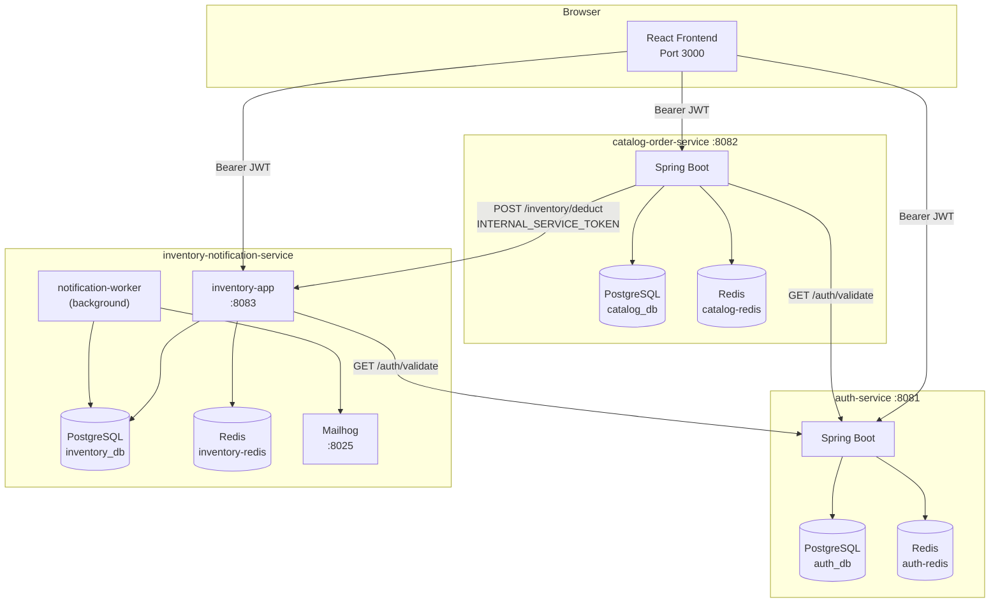
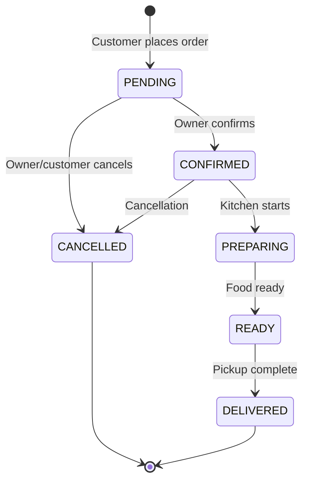
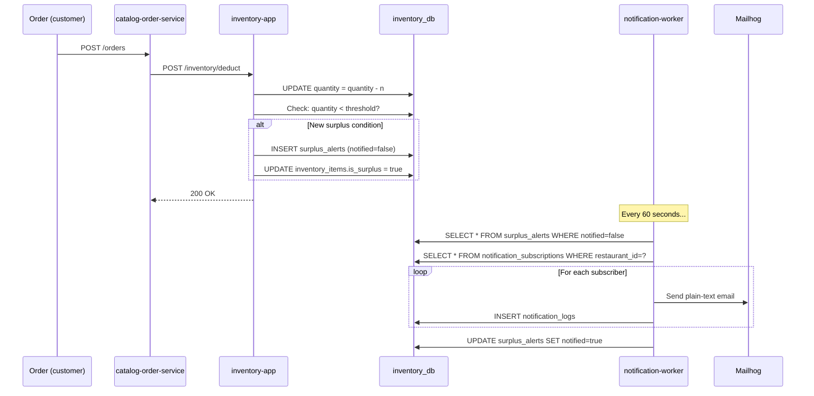
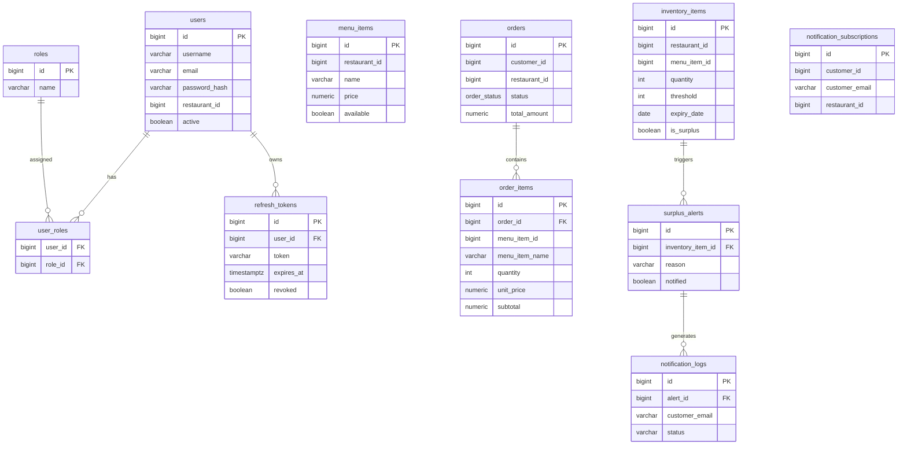

# FoodWise — System Diagrams

## System Architecture (Mermaid)

```mermaid
graph TB
    subgraph "Browser"
        FE["React Frontend<br/>Port 3000"]
    end

    subgraph "auth-service  :8081"
        AUTH["Spring Boot"]
        AUTH_PG[("PostgreSQL<br/>auth_db")]
        AUTH_R[("Redis<br/>auth-redis")]
        AUTH --> AUTH_PG
        AUTH --> AUTH_R
    end

    subgraph "catalog-order-service  :8082"
        CAT["Spring Boot"]
        CAT_PG[("PostgreSQL<br/>catalog_db")]
        CAT_R[("Redis<br/>catalog-redis")]
        CAT --> CAT_PG
        CAT --> CAT_R
    end

    subgraph "inventory-notification-service"
        INV["inventory-app<br/>:8083"]
        WORKER["notification-worker<br/>(background)"]
        INV_PG[("PostgreSQL<br/>inventory_db")]
        INV_R[("Redis<br/>inventory-redis")]
        MAIL["Mailhog<br/>:8025"]
        INV --> INV_PG
        INV --> INV_R
        WORKER --> INV_PG
        WORKER --> MAIL
    end

    FE -- "Bearer JWT" --> AUTH
    FE -- "Bearer JWT" --> CAT
    FE -- "Bearer JWT" --> INV
    CAT -- "GET /auth/validate" --> AUTH
    INV -- "GET /auth/validate" --> AUTH
    CAT -- "POST /inventory/deduct<br/>INTERNAL_SERVICE_TOKEN" --> INV
```

---

## Order Lifecycle (Mermaid)

```mermaid
stateDiagram-v2
    [*] --> PENDING: Customer places order
    PENDING --> CONFIRMED: Owner confirms
    PENDING --> CANCELLED: Owner/customer cancels
    CONFIRMED --> PREPARING: Kitchen starts
    CONFIRMED --> CANCELLED: Cancellation
    PREPARING --> READY: Food ready
    READY --> DELIVERED: Pickup complete
    CANCELLED --> [*]
    DELIVERED --> [*]
```

---

## Surplus Alert Flow (Mermaid)

```mermaid
sequenceDiagram
    participant O as Order (customer)
    participant C as catalog-order-service
    participant I as inventory-app
    participant DB as inventory_db
    participant W as notification-worker
    participant M as Mailhog

    O->>C: POST /orders
    C->>I: POST /inventory/deduct
    I->>DB: UPDATE quantity = quantity - n
    I->>DB: Check: quantity < threshold?
    alt New surplus condition
        I->>DB: INSERT surplus_alerts (notified=false)
        I->>DB: UPDATE inventory_items.is_surplus = true
    end
    I-->>C: 200 OK

    Note over W: Every 60 seconds...
    W->>DB: SELECT * FROM surplus_alerts WHERE notified=false
    W->>DB: SELECT * FROM notification_subscriptions WHERE restaurant_id=?
    loop For each subscriber
        W->>M: Send plain-text email
        W->>DB: INSERT notification_logs
    end
    W->>DB: UPDATE surplus_alerts SET notified=true
```

---

## Database Schema (Mermaid)

```mermaid
erDiagram
    %% auth_db
    users {
        bigint id PK
        varchar username
        varchar email
        varchar password_hash
        bigint restaurant_id
        boolean active
    }
    roles {
        bigint id PK
        varchar name
    }
    user_roles {
        bigint user_id FK
        bigint role_id FK
    }
    refresh_tokens {
        bigint id PK
        bigint user_id FK
        varchar token
        timestamptz expires_at
        boolean revoked
    }
    users ||--o{ user_roles : has
    roles ||--o{ user_roles : assigned
    users ||--o{ refresh_tokens : owns

    %% catalog_db
    menu_items {
        bigint id PK
        bigint restaurant_id
        varchar name
        numeric price
        boolean available
    }
    orders {
        bigint id PK
        bigint customer_id
        bigint restaurant_id
        order_status status
        numeric total_amount
    }
    order_items {
        bigint id PK
        bigint order_id FK
        bigint menu_item_id
        varchar menu_item_name
        int quantity
        numeric unit_price
        numeric subtotal
    }
    orders ||--o{ order_items : contains

    %% inventory_db
    inventory_items {
        bigint id PK
        bigint restaurant_id
        bigint menu_item_id
        int quantity
        int threshold
        date expiry_date
        boolean is_surplus
    }
    surplus_alerts {
        bigint id PK
        bigint inventory_item_id FK
        varchar reason
        boolean notified
    }
    notification_subscriptions {
        bigint id PK
        bigint customer_id
        varchar customer_email
        bigint restaurant_id
    }
    notification_logs {
        bigint id PK
        bigint alert_id FK
        varchar customer_email
        varchar status
    }
    inventory_items ||--o{ surplus_alerts : triggers
    surplus_alerts ||--o{ notification_logs : generates
```
